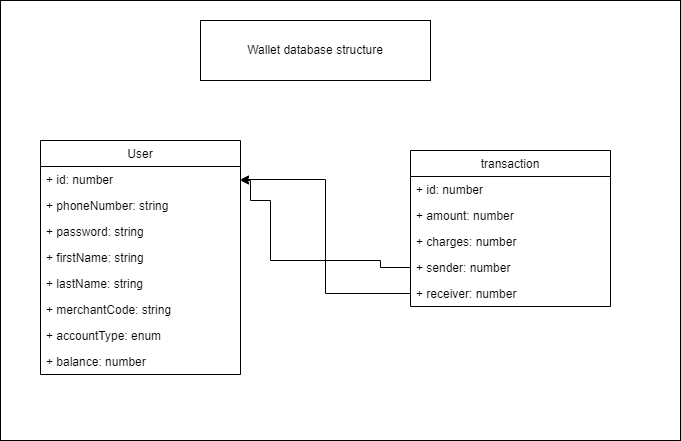

<div id="top"></div>


<!-- PROJECT LOGO -->
<br />
<div align="center">
 

  <h3 align="center">Wallet [in reference to mobile money]</h3>

</div>


<!-- ABOUT THE PROJECT -->
## About The Project

[![Product Name Screen Shot][product-screenshot]](https://example.com)

This is an api implementation of wallet modelled from mobile money

Features
* Send money to other people/ applying charges
* Send money to merchants/business account
* Reports


### Built With

This project is built on top of the following technologies


* [Nodejs](https://nodejs.org/en/)
* [Express js](https://expressjs.com/)
* [Nestjs](https://nestjs.com/)
* [mysql](https://www.mysql.com/)


<!-- GETTING STARTED -->
## Getting Started

Steps to run this project locally

### Prerequisites

check if you have mysql server, node and nest and if you do not please refer to the list above for relevant steps on install each tool


### Installation

First, download this codebase to your computer by using github's download or 

1. Clone the repo
   ```sh
   git clone https://github.com/your_username_/Project-Name.git
   ```
2. Install NPM packages
   ```sh
   npm install
   ```
### run 

```bash
# development
$ npm run start

# watch mode
$ npm run start:dev

# production mode
$ npm run start:prod
```


<!-- USAGE EXAMPLES -->
## Usage / Api documentation

For examples on how this api works please refer to its Api documentation which you can find by visiting http://localhost:3000/api in your browser

### DB design 


### TODO
* Tests
* Dockerizing the app

Asante!
<p align="right">(<a href="#top">back to top</a>)</p>